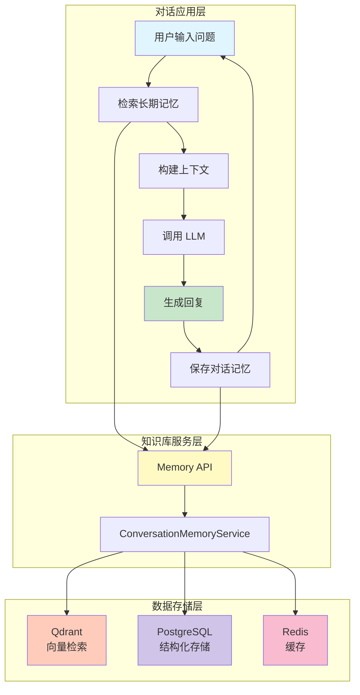
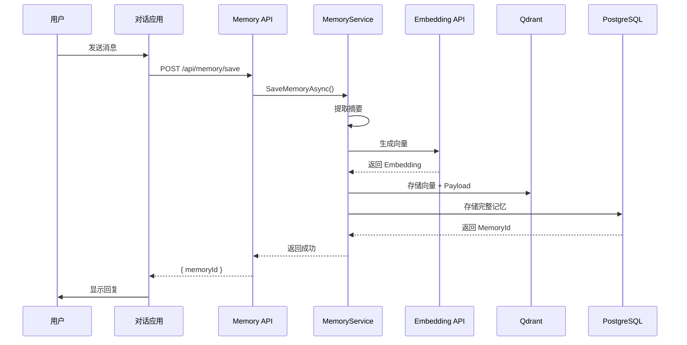
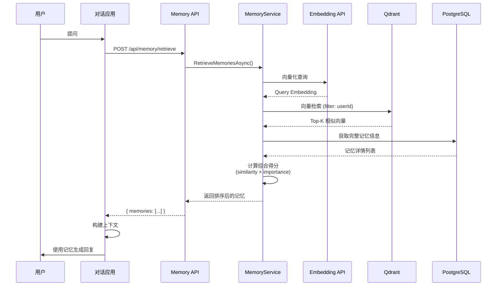
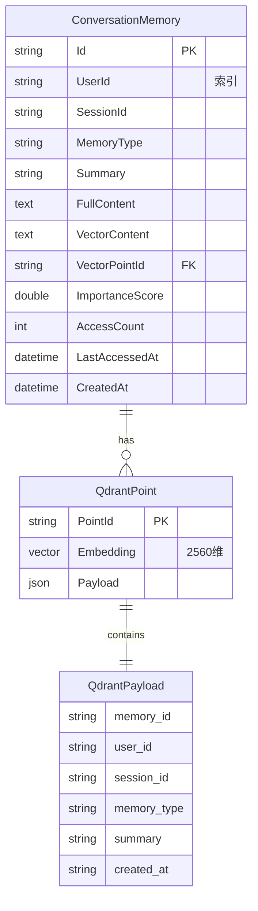
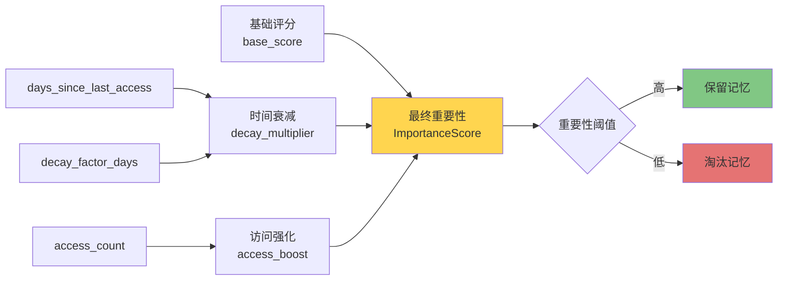
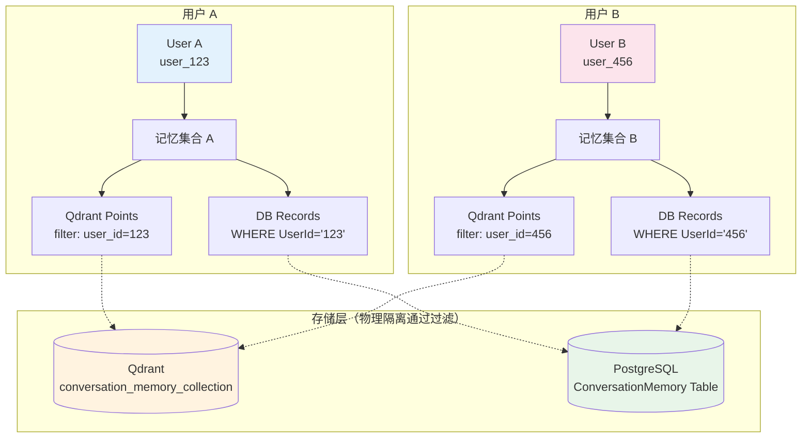
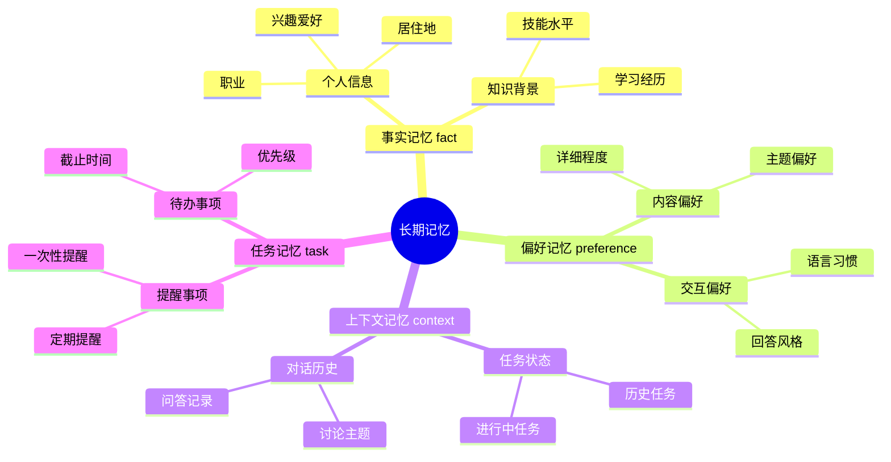
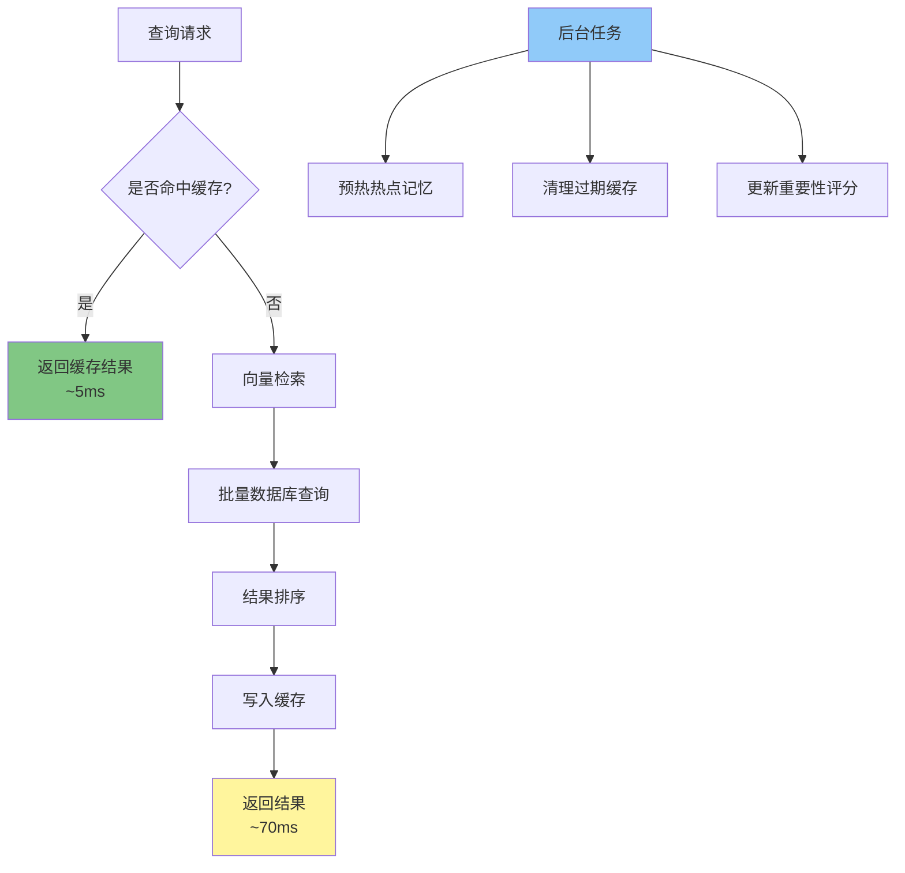
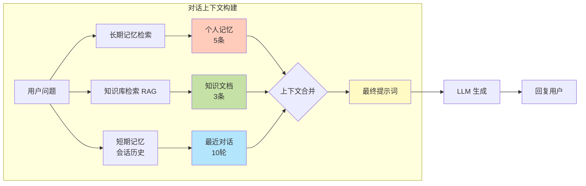
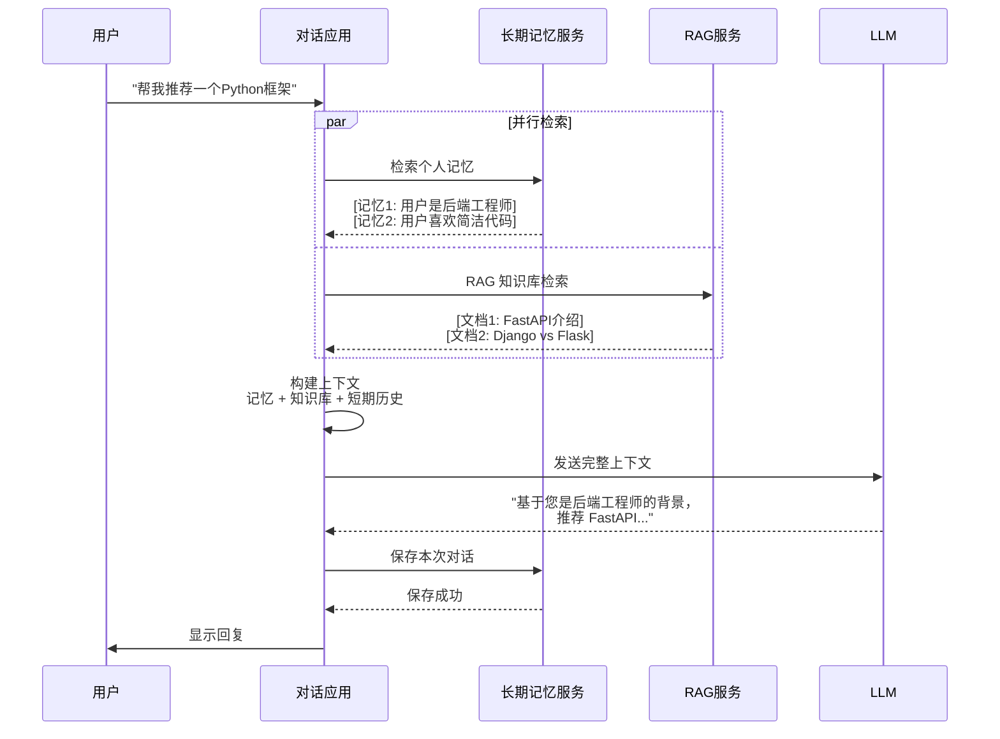

# 长期记忆系统架构图

## 整体架构

## 记忆保存流程

## 记忆检索流程

## 数据模型关系

## 记忆重要性计算

## 用户隔离架构

## 记忆类型分类

## 性能优化策略

## 与知识库集成

## 数据流时序图（完整流程）

---

## 使用说明

这些 Mermaid 图表可以：

1. **在 Markdown 中直接渲染**（GitHub、VS Code、Typora 等）
2. **导出为图片**：使用 [Mermaid Live Editor](https://mermaid.live/)
3. **集成到文档**：添加到 README 或技术文档中

## 图表说明

| 图表 | 用途 |
|------|------|
| 整体架构 | 展示系统分层结构 |
| 记忆保存流程 | 详细的保存步骤 |
| 记忆检索流程 | 详细的检索步骤 |
| 数据模型关系 | ER 图，表结构关系 |
| 记忆重要性计算 | 淘汰策略逻辑 |
| 用户隔离架构 | 多用户数据隔离 |
| 记忆类型分类 | 思维导图，记忆分类 |
| 性能优化策略 | 缓存和批量查询 |
| 与知识库集成 | 多源上下文合并 |
| 完整数据流 | 端到端时序图 |
