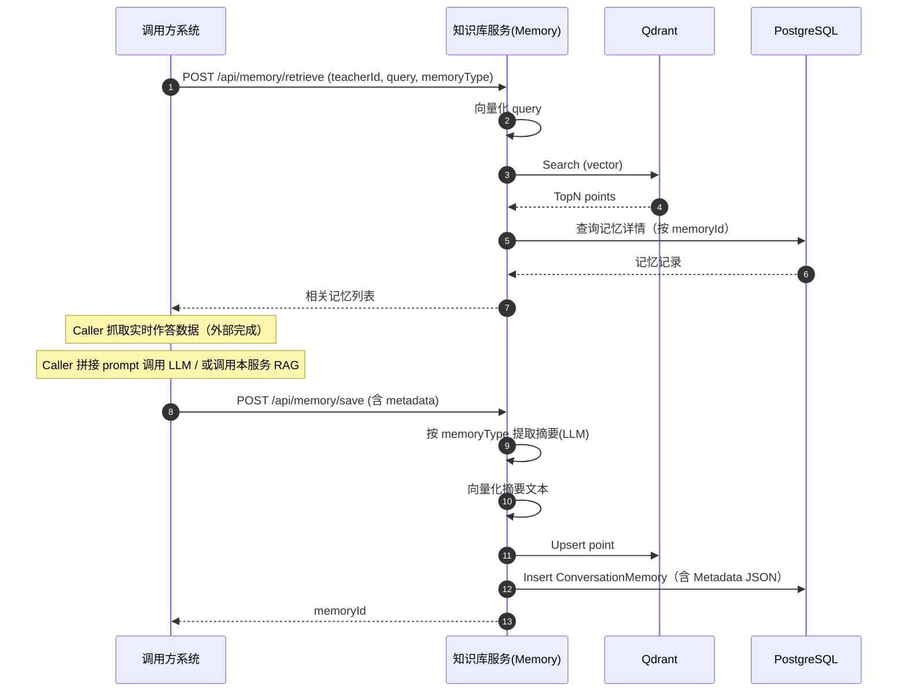

# 教学场景完整接口调用流程

> 说明：实时作答数据由“调用方系统”抓取，本服务负责：记忆检索/记忆保存/（可选）RAG 生成能力。

## 1. 调用方与本服务的整体交互

### 1.1 老师提问（一次完整闭环）

**目标问题示例**：老师问「当前试卷总共有多少学生作答？」

**调用方流程（推荐）**：

1. 调用方系统从业务库/作答系统抓取实时数据（本服务不做这一步）
2. 调用方系统调用本服务“检索记忆”，获取该老师历史相关上下文（可选但推荐）
3. 调用方系统将：实时数据 + 检索到的记忆 + 老师问题 + 系统提示词 组合，调用本服务的 RAG 接口（或调用方直连 LLM）调用方系统           知识库服务          Qdrant          PostgreSQL
    │                    │                │                │
    │  1. POST /retrieve │                │                │
    │───────────────────>│                │                │
    │                    │  2. 向量化查询  │                │
    │                    │───────────────>│                │
    │                    │  3. 返回匹配点  │                │
    │                    │<───────────────│                │
    │                    │  4. 查询记忆详情│                │
    │                    │────────────────────────────────>│
    │                    │  5. 返回记忆数据│                │
    │                    │<────────────────────────────────│
    │  6. 返回记忆列表   │                │                │
    │<───────────────────│                │                │
    │                    │                │                │
    │  7. POST /save     │                │                │
    │───────────────────>│                │                │
    │                    │  8. LLM提取摘要 │                │
    │                    │  (根据类型选提示词)             │
    │                    │  9. 向量化摘要  │                │
    │                    │───────────────>│                │
    │                    │  10. 存储向量   │                │
    │                    │<───────────────│                │
    │                    │  11. 存储结构化 │                │
    │                    │────────────────────────────────>│
    │  12. 返回memoryId  │                │                │
    │<───────────────────│                │                │
4. 得到回答后，调用方系统调用本服务“保存记忆”（建议带 metadata，便于后续复用）

### 1.2 追问（同一试卷/同一会话）

- 调用方仍然负责实时数据抓取，但可以在调用方侧做增量抓取/缓存策略
- 本服务侧通过 `memoryType + metadata`（如 `examId/classId`）让摘要更贴合教学场景、可复用

---

## 2. API 接口清单（Memory）

| 接口 | 方法 | 用途 |
|---|---:|---|
| `/api/memory/save` | POST | 保存对话为记忆（支持 metadata） |
| `/api/memory/retrieve` | POST | 语义检索相关记忆（支持按 memoryType 过滤） |
| `/api/memory/{userId}/recent` | GET | 获取最近 N 条记忆（时间序列） |
| `/api/memory/{userId}/cleanup` | POST | 清理低重要性记忆（保留前 N 条） |
| `/api/memory/{userId}` | DELETE | 删除用户所有记忆 |

> 备注：本项目内存储与检索由 `MemoryController` + `IConversationMemoryService` 提供。

---

## 3. 推荐的记忆类型（教学场景扩展）

| 类型 | code | 说明 | 摘要示例 |
|---|---|---|---|
| 试卷分析 | `exam_analysis` | 试卷整体指标与结论 | 【高二数学期中】平均分78分，及格率89%，第5题错误率60% |
| 学生画像 | `student_profile` | 单个学生表现趋势与关注点 | 【李明】近3次考试下滑，从85降至72，需关注函数题 |
| 班级汇总 | `class_summary` | 班级整体情况 | 【高二(3)班】45人全部提交，整体表现优于(2)班 |
| 答题规律 | `answer_pattern` | 共性错误与知识点问题 | 【函数求导】60%出错，主要链式法则使用不当 |
| 教学洞察 | `teaching_insight` | 教学策略建议/章节反馈 | 【三角函数】掌握较好，可减少复习，增加应用题 |
| 老师偏好 | `preference` | 老师关注指标/展示偏好 | 老师偏好先看及格率、后进生名单，喜欢简洁汇总 |

---

## 4. 教学场景：完整调用示例（建议顺序）

### 4.1 Step A：检索历史记忆（可选，但推荐）

**用途**：老师追问时（或跨会话）减少重复解释、复用历史分析结论。

请求：

```http
POST /api/memory/retrieve
Content-Type: application/json

{
  "userId": "teacher_001",
  "query": "当前试卷总共有多少学生作答？",
  "topK": 3,
  "minScore": 0.5,
  "memoryType": "exam_analysis"
}
```

响应（示例，字段按 API 输出）：

```json
{
  "count": 1,
  "memories": [
    {
      "id": "mem_xxx",
      "sessionId": "session_20260204_001",
      "memoryType": "exam_analysis",
      "summary": "【高二数学期中】45人提交，平均分78分，及格率89%，第5题错误率60%",
      "fullContent": "{\"user\":\"...\",\"assistant\":\"...\"}",
      "similarityScore": 0.83,
      "importanceScore": 0.8,
      "createdAt": "2026-02-04T10:30:00Z",
      "lastAccessedAt": "2026-02-04T10:35:00Z"
    }
  ]
}
```

### 4.2 Step B：调用方抓取实时数据（调用方完成）

示例（调用方内部数据结构，仅说明用途）：

```json
{
  "examId": "exam_midterm_2026_math",
  "submitCount": 45,
  "totalStudents": 45,
  "avgScore": 78,
  "passRate": 0.89,
  "questionErrorRates": { "5": 0.60 }
}
```

### 4.3 Step C：调用方发给 LLM（两种方式）

- **方式 1**：调用本服务现有 RAG 查询接口（如果你的调用方已集成）
- **方式 2**：调用方直连 LLM（将实时数据 + 记忆内容拼到 prompt 里）

> 本文重点是 Memory 接口流程；RAG 的具体接口以当前系统的 RAG Controller 为准。

### 4.4 Step D：保存记忆（强烈推荐带 metadata）

**用途**：把“实时数据 + 本次分析结论”转成可复用摘要；未来追问/跨会话能检索到。

请求：

```http
POST /api/memory/save
Content-Type: application/json

{
  "userId": "teacher_001",
  "sessionId": "session_20260204_001",
  "userMessage": "当前试卷总共有多少学生作答？",
  "assistantMessage": "本次试卷共45人作答，平均分78分，及格率89%。第5题错误率最高，为60%。",
  "memoryType": "exam_analysis",
  "importanceScore": 0.8,
  "metadata": {
    "examId": "exam_midterm_2026_math",
    "examName": "高二数学期中考试",
    "classId": "class_g2_03",
    "className": "高二(3)班",
    "subject": "数学",
    "metrics": {
      "submitCount": 45,
      "totalStudents": 45,
      "avgScore": 78,
      "passRate": 0.89,
      "maxScore": 98,
      "minScore": 42
    }
  }
}
```

响应：

```json
{
  "memoryId": "<guid>",
  "message": "记忆保存成功"
}
```

---

## 5. 时序图（Mermaid）

> 说明：调用方抓取实时数据不在图中展开，仅展示与本服务交互。



---

## 6. 实务建议（教学场景）

- `userId` 建议使用“老师ID”，以保证记忆隔离与检索准确
- `sessionId` 推荐使用“会话ID/试卷ID/课堂ID”，用于追问场景自然聚合
- `metadata` 至少包含 `examId/classId/subject`；若有统计指标，放在 `metrics`，便于摘要与后续分析
- 记忆保存的 `assistantMessage` 建议是“最终给老师看的结论版回答”，而不是中间推理过程
